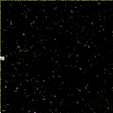
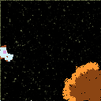
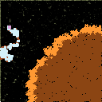
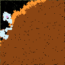
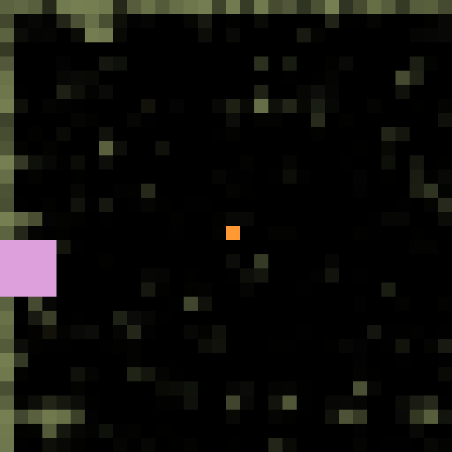
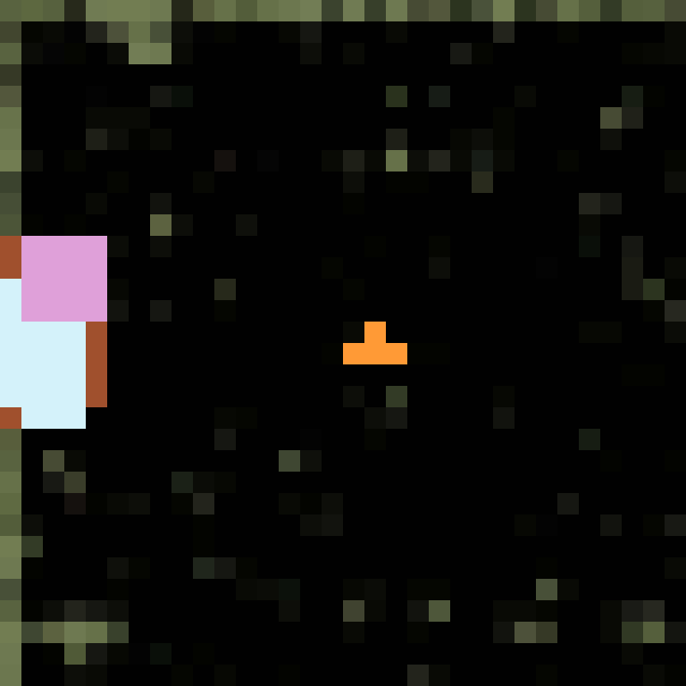
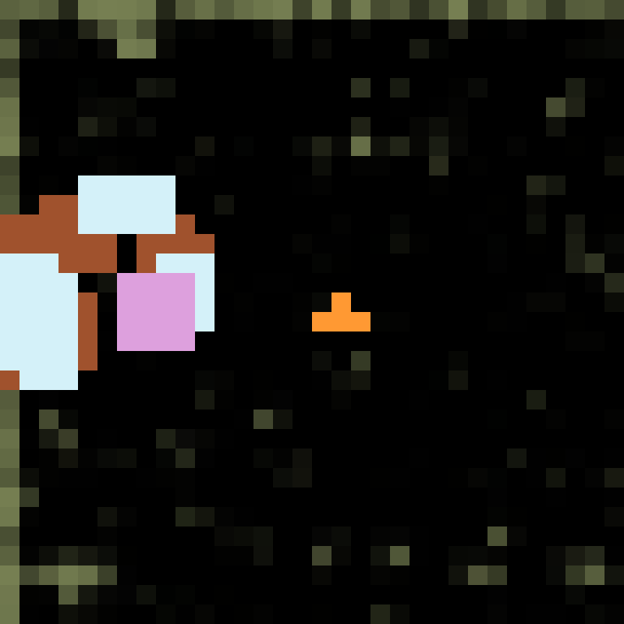
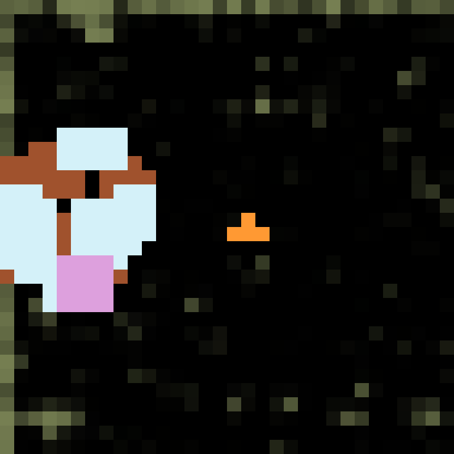

# Project Summary: Autonomous Drone Swarm for Wildfire Mitigation

## 1. Project Overview & Environment Setup
Our overarching goal is to deploy a Multi-Agent Reinforcement Learning (MARL) swarm of drones that can cooperatively dig firelines to contain rapidly spreading wildfires. We are using **SimFire**, a high-fidelity Rothermel-based wildfire simulation, wrapped in an RL environment using **SimHarness2** and **Ray RLlib**.

### RL Components
* **Observations (State):** The environment provides a continuous multi-channel 2D spatial map. The channels include the `fire_map` (unburned, burning, burned, mitigated), `elevation`, `wind_speed`, `wind_direction`, and mitigation data. To optimize learning, we normalized the static terrain factors to a standard `[0, 1]` range, ensuring the Convolutional Neural Network (CNN) feature extractor would not suffer from exploding gradients.
* **Action Space:** Discrete actions encompassing 4 movement directions (up, down, left, right), no-op, and interaction commands (placing a fireline/wetline).
* **Reward Shaping:** Initially, reward sparsity made it impossible for the agent to learn. We transitioned to the `AreaSavedPropReward`, which compares the total burned area to a baseline simulation without the drone. To speed up early exploration, we added small step penalties: `-0.0001` for moving, and an additional `-0.0002` for digging a fireline. 

## 2. Training on the 128x128 Map
Initially, we started training a single drone on a massive 128x128 grid.
* **Iterations 5 to 20:** The agent moved randomly, exploring the map with no understanding of the fire dynamics. The reward remained heavily negative.
* **Iterations 500 to 550:** After several hours of training, the drone began to show early signs of intent, occasionally digging near the fire. However, the massive 128x128 map caused the simulation to run incredibly slowly (due to thousands of unburned cells requiring physics updates). Furthermore, the spatial size made the reward signal too sparse for a single agent to quickly solve.

### Visualizing 128x128 Training (Iter 550)
*Early stages of learning. The agent (blue) navigates the large terrain while the fire (orange) spreads.*

 
 

## 3. Transition to 32x32 Map & Technical Hurdles
To increase the iteration throughput and densify the reward signal, we downscaled the environment to `32x32`.
While training speed drastically improved, we ran into several obscure physics and rendering issues.

### The Rendering IPC Crash
We discovered that Pygame (used for rendering evaluations) was failing silently due to Inter-Process Communication (IPC) overhead when spawned alongside multiple RLlib background workers. We bypassed this by forcing evaluation to run synchronously in the foreground (`evaluation_num_workers: 0`), allowing us to cleanly watch the agent.

### The "2-Second" Fire Bug
During the 32x32 tests, we noticed the episode would end abruptly after just a few steps (appearing as 2 seconds on the screen) with the fire instantly dying out, making it impossible for the agent to learn. After deep debugging, we traced this to a configuration flaw: `max_fire_duration: 10`. This parameter was forcing individual burning pixels to completely extinguish after 10 simulation steps. Because the wind speed was low, the Rate of Spread (ROS) took longer than 10 steps to accumulate, meaning the fire would entirely put itself out before spreading to even a single adjacent cell! We resolved this by increasing `max_fire_duration` to `100`, which finally restored the dynamic, realistic fire spread.

### Visualizing 32x32 Training
*Training on the denser 32x32 map, where the drone is much larger relative to the fire spread.*

 
 

## 4. Current State & Next Steps
We are now fully prepared. We have:
1. Validated and normalized observations.
2. Verified the custom CNN policy architecture.
3. Successfully tuned the reward function.
4. Resolved the critical simulation physics bugs.

**Immediate Next Steps:**
1. Execute a fresh overnight PPO training run on the 32x32 map.
2. Once the single-agent successfully learns to trace the perimeter of the fire, we will transition back to the 128x128 map.
3. Deploy the Multi-Agent framework (MARL), allowing 4+ drones to coordinate.
4. Introduce continuous action spaces for smoother, more precise flight patterns.

The progress and configuration of this project can be found in the associated GitHub repository.
